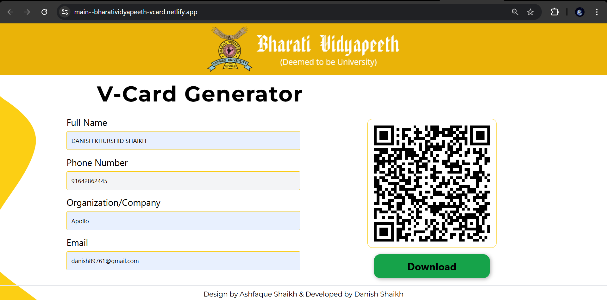

# 📇 vCard Generator (Contact QR Code Tool)

A simple and efficient web application built using React, HTML, and CSS that allows users to generate a vCard-compliant QR code. When scanned, this QR code auto-fills contact details in the user's phone contacts app — perfect for networking, business cards, and events.

🚀 [Live Demo](https://main--bharatividyapeeth-vcard.netlify.app/)

---

## ✨ Features

- 📝 Input form for Name, Phone, Email, Organization, etc.
- ⚡ Real-time QR code generation using vCard format
- 📱 Mobile-ready: scan and auto-save contact in one tap
- 📤 Deployed via Netlify

---

## 🛠 Tech Stack

- **Frontend**: React.js, HTML5, CSS3
- **Libraries**: `qrcode.react` (for QR generation)
- **Deployment**: Netlify

---

## 📷 Preview



*(Replace with actual screenshot if available)*

---

## 🔧 How to Run Locally

```bash
git clone https://github.com/your-username/vcard-generator.git
cd vcard-generator
npm install
npm start
